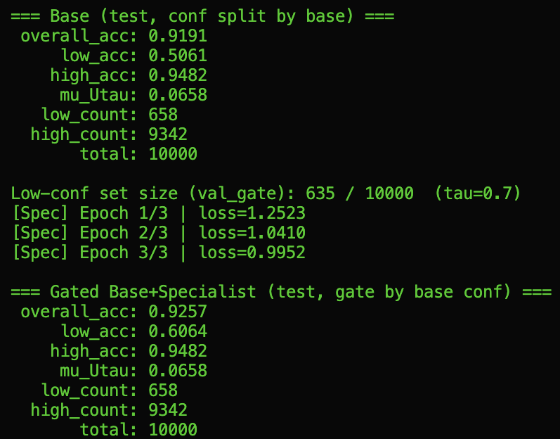
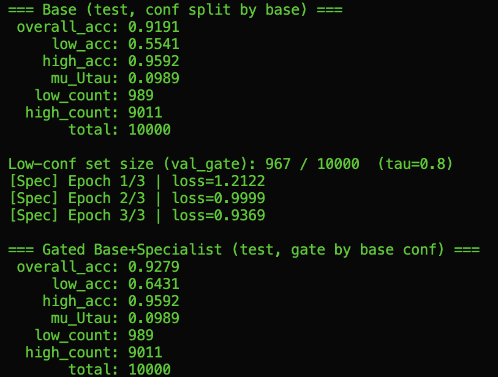
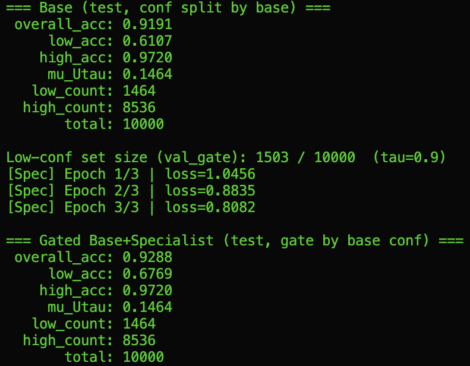
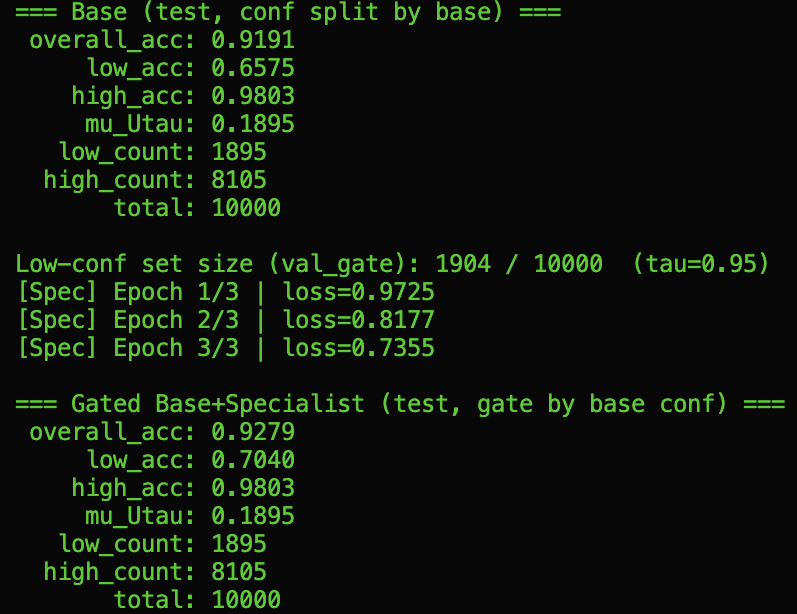
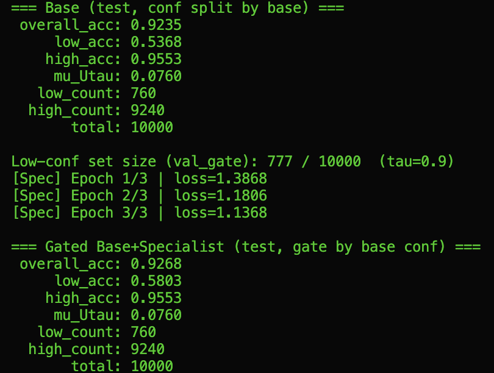

# 2025_2_MAT3123-01_project

## Conditional Specialist Learning on Low-Confidence Inputs

Fashion-MNIST (CPU-only), GitHub README report

## Abstract

A standard classifier applies one decision rule uniformly, even though prediction reliability varies across inputs. This project proposes a piecewise classifier that routes high-confidence samples to a base CNN and low-confidence samples to a specialist model fine-tuned only on those uncertain cases. On Fashion-MNIST, this conditional approach consistently improves accuracy on low-confidence inputs while preserving high-confidence performance, resulting in improved overall accuracy.

---

## 1. Method

### Base classifier and confidence

Let $f(x)\in\mathbb{R}^{10}$ be the base CNN logits. Define

$$p(x)=\mathrm{softmax}(f(x)),\qquad \mathrm{conf}(x)=\max_i p_i(x).$$

### Low-confidence set

For a threshold $\tau\in(0,1)$,

$$U_\tau = {x:\mathrm{conf}(x)<\tau}.$$

### Specialist training objective

A specialist (g) is obtained by fine-tuning the base CNN on samples from a held-out validation subset that satisfy $x\in U_\tau$. Conceptually, this targets the conditional risk

$$\mathbb{E}[\ell(g(x),y)\mid x\in U_\tau].$$

### Final decision rule

At test time (label-free routing),

$$
h(x) =
\arg\max f(x) \quad \text{if } x \notin U_\tau
$$
$$
\arg\max g(x) \quad \text{if } x \in U_\tau
$$

---

## 2. Experimental Setup

* Dataset: Fashion-MNIST (60k train / 10k test)
* Split: training set randomly split into:

  * `train_base`: train the base model $f$
  * `val_gate`: identify low-confidence samples and fine-tune specialist $g$
* No leakage: test set is used only for evaluation.
* Models: BaseCNN; Specialist = BaseCNN initialized from base weights then fine-tuned on the low-confidence subset of `val_gate`.
* Metrics reported per $\tau$:

  * overall accuracy
  * accuracy on $U_\tau$ (low-confidence accuracy)
  * accuracy on $U_\tau^c$ (high-confidence accuracy)
  * $\mu(U_\tau)$: fraction of test samples in $U_\tau$

---

## 3. Results

Note: The base model f is fixed; changing τ only changes the confidence-based split (U_tau vs U_tau^c).  
Therefore, the base overall accuracy stays the same across τ, while low/high-region accuracies and μ(Uτ) change.

### Results on Fashion-MNIST

(“Gated” = Base + Specialist with routing by base confidence)

| τ    | Model | Overall Acc | Low-Conf Acc | High-Conf Acc | μ(Uτ)  |
| ---- | ----- | ----------- | ------------ | ------------- | ------ |
| 0.7  | Base  | 0.9191      | 0.5061       | 0.9482        | 0.0658 |
| 0.7  | Gated | 0.9257      | 0.6064       | 0.9482        | 0.0658 |
| 0.8  | Base  | 0.9191      | 0.5541       | 0.9592        | 0.0989 |
| 0.8  | Gated | 0.9279      | 0.6431       | 0.9592        | 0.0989 |
| 0.9  | Base  | 0.9191      | 0.6107       | 0.9720        | 0.1464 |
| 0.9  | Gated | 0.9288      | 0.6769       | 0.9720        | 0.1464 |
| 0.95 | Base  | 0.9191      | 0.6575       | 0.9803        | 0.1895 |
| 0.95 | Gated | 0.9279      | 0.7040       | 0.9803        | 0.1895 |

Key observation: For every $\tau$, the gated method improves low-confidence accuracy while keeping high-confidence accuracy unchanged, leading to consistent overall gains.

---

## 4. Discussion

* Why it works: The low-confidence region $U_\tau$ contains systematically difficult inputs. Fine-tuning a specialist on this region approximates minimizing conditional error on $U_\tau$, improving performance specifically where the base model is uncertain.
* No degradation on easy cases: High-confidence accuracy remains identical for each $\tau$, meaning the routing rule does not harm confident predictions.
* Effect of $\tau$: As $\tau$ increases, $\mu(U_\tau)$ grows (more samples routed to specialist), and low-confidence accuracy improves reliably under the specialist.

---

## 5. Limitations

* Requires a held-out set (`val_gate`) to identify low-confidence samples for specialist training.
* Adds an extra training stage (fine-tuning the specialist).
* Depends on the calibration/quality of the base model confidence.

---

## 6. Conclusion

This project demonstrates a simple and mathematically interpretable approach to conditional learning: split the input space by confidence and train a specialist on the uncertain region. On Fashion-MNIST, this consistently improves low-confidence accuracy and yields higher overall accuracy without sacrificing high-confidence performance.

---

## 7. Logs / Screenshots

Training & evaluation logs (screenshots)

---

## 8. Additional Experiment: Stronger Base Model (20 epochs)

To study how base model strength affects the low-confidence region and the benefits of specialization, we additionally trained the base model for 20 epochs with $\tau=0.9$.

| Setting                       | Model | Overall Acc | Low-Conf Acc | High-Conf Acc |  μ(Uτ) |
| ----------------------------- | ----- | ----------: | -----------: | ------------: | -----: |
| Base trained 20 epochs, τ=0.9 | Base  |      0.9235 |       0.5368 |        0.9553 | 0.0760 |
| Base trained 20 epochs, τ=0.9 | Gated |      0.9268 |       0.5803 |        0.9553 | 0.0760 |

This additional run still shows improvement on the low-confidence set and a higher overall accuracy, while the low-confidence region becomes smaller ($\mu(U_\tau)$ decreases), consistent with the base model becoming more confident.

---
